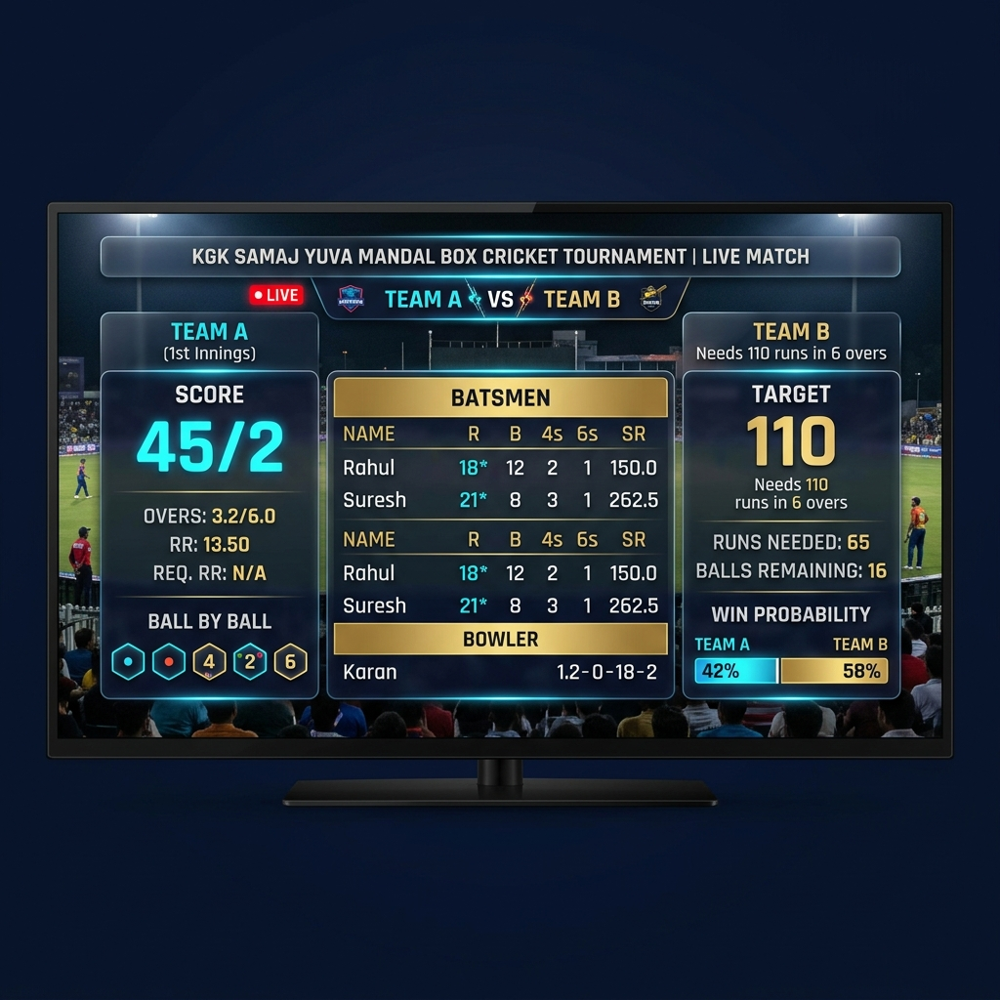
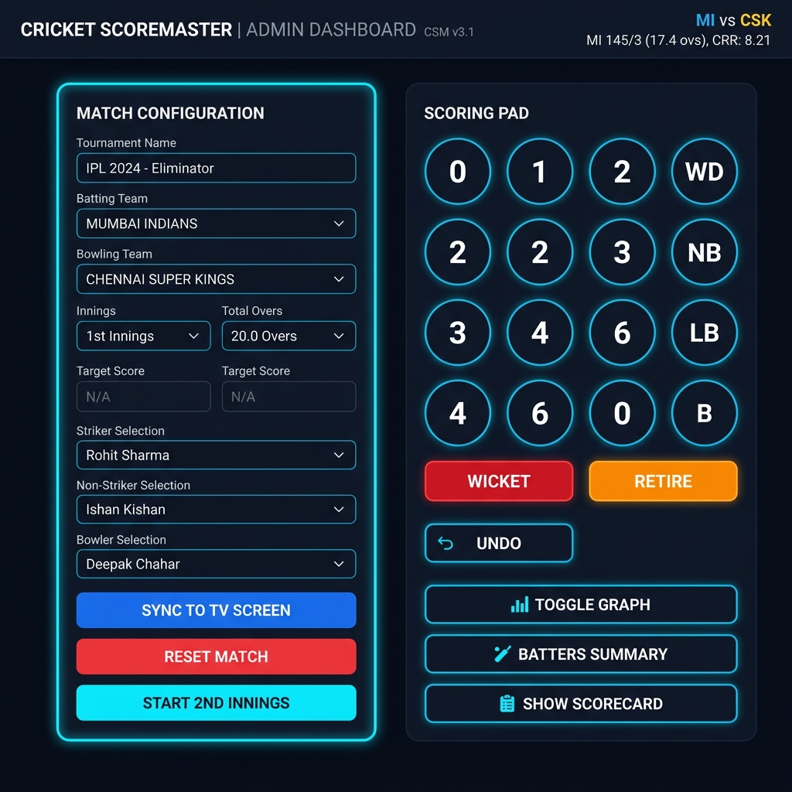
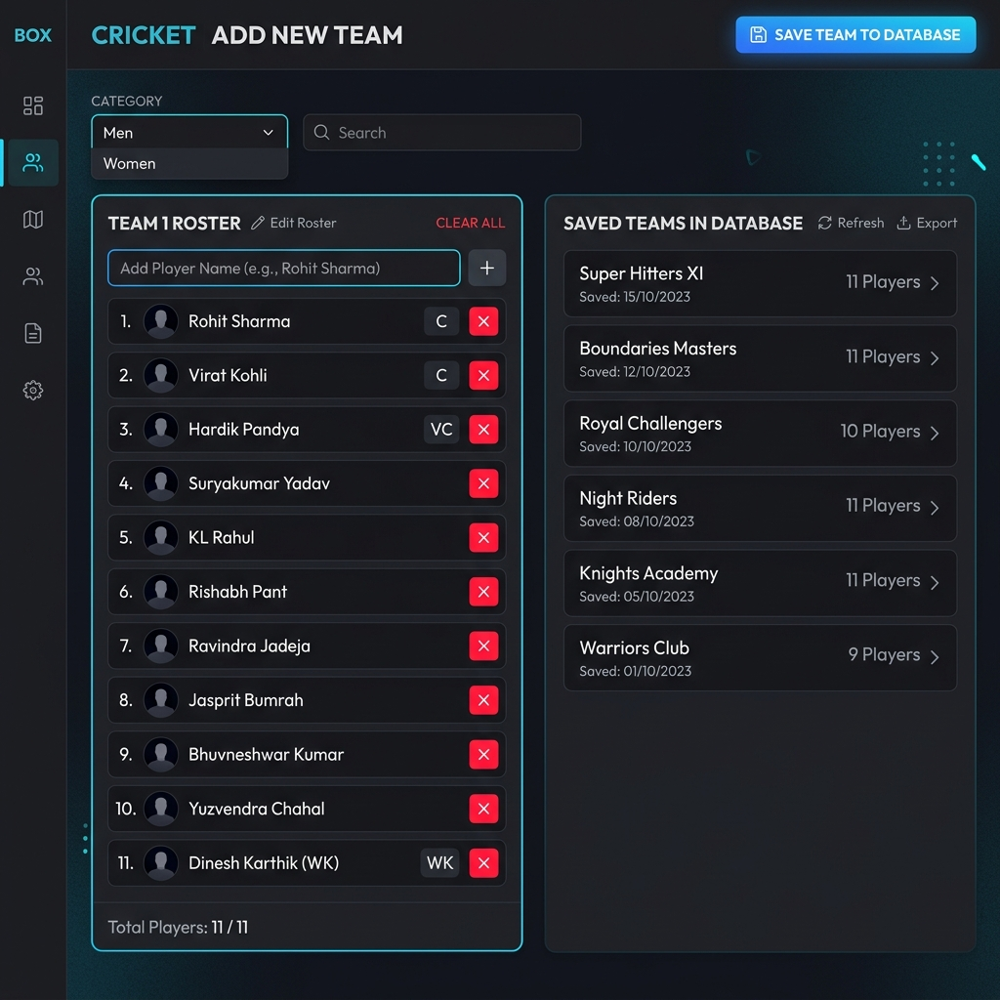

<](https://nodejs.org/)
[](https://www.postgresql.org/)
[](https://socket.io/)
[](https://expressjs.com/)

---

*Score live matches, display stunning TV-quality broadcast graphics on a big screen, and manage teams — all from one app.*

</div>

---

## 📸 Screenshots

### 🖥️ Live TV Broadcast Screen
> The broadcast view is designed to be displayed on a TV or projector in fullscreen mode. It shows real-time scores, batter & bowler stats, run rates, win probability, and animated event overlays.



---

### ⚙️ Admin Dashboard
> The admin panel lets you control the entire match from any browser. Configure match settings, select players, and score ball-by-ball — all changes sync instantly to the broadcast screen.



---

### 👥 Team & Player Management
> Create and manage unlimited teams with player rosters, organized by category (Man / Woman / Couple). Upload player images that appear on broadcast overlays.



---

## ✨ Features

| Feature | Description |
|---|---|
| 🔴 **Real-Time Sync** | Powered by Socket.IO — every button press on the admin panel instantly updates the broadcast screen on TV |
| 📺 **TV Broadcast Graphics** | Professional-grade fullscreen overlay designed for 1920×1080 displays with glassmorphism, neon accents, and animations |
| 🎬 **Animated Event Overlays** | Giant cinematic animations for **FOUR**, **SIX**, **WICKET**, **NOT OUT**, **WIDE**, **NO BALL**, and **FREE HIT** events |
| 📊 **Over-by-Over Analysis Graph** | Visual bar chart showing runs scored per over with wicket indicators (red dots) |
| 🏏 **Batter Summary Overlay** | Detailed popup showing both batters at crease with runs, balls, 4s, 6s, and strike rate |
| 📋 **Full Batting Scorecard** | Complete batting scorecard overlay with all batters, their status, and detailed stats |
| ⚾ **Bowling Scorecard** | Full bowling figures overlay showing overs, maidens, runs, wickets, and economy rate |
| 👥 **Playing Squads Display** | Show both team squads with player images before/during the match |
| 📈 **Win Probability** | Live win probability bar that updates dynamically during the 2nd innings chase |
| 🔄 **Undo System** | Made a mistake? Undo the last ball delivery with a single click |
| 💾 **Match State Persistence** | Full match state is saved to PostgreSQL after every ball — refresh or restart without losing data |
| 🖼️ **Player Images** | Upload and sync player photos (base64 encoded) that display on broadcast overlays |
| 🏷️ **Multi-Category Support** | Organize teams by category: **MAN**, **WOMAN**, or **COUPLE** tournaments |
| 🎯 **Free Hit Indicator** | Toggle free hit status with a visible badge on the broadcast screen |
| 📱 **Multi-Device** | Admin and broadcast can run on separate devices — any browser on the same network |

---

## 🏗️ Architecture — How It Works

```
┌─────────────────┐         WebSocket (Socket.IO)         ┌──────────────────┐
│   ADMIN PANEL   │ ◄──────────────────────────────────► │   NODE.JS SERVER  │
│   (Browser)     │         Real-time bidirectional       │   (Express)       │
│                 │                                       │                   │
│  • Score runs   │                                       │  • REST API       │
│  • Take wickets │                                       │  • WebSocket hub  │
│  • Config match │                                       │  • DB persistence │
└─────────────────┘                                       └────────┬──────────┘
                                                                   │
                                                                   │ SQL Queries
                                                                   ▼
┌─────────────────┐         WebSocket (Socket.IO)         ┌──────────────────┐
│  TV BROADCAST   │ ◄──────────────────────────────────► │   POSTGRESQL DB   │
│   (Browser)     │         Real-time state updates       │                   │
│                 │                                       │  • app_state      │
│  • Live score   │                                       │  • teams          │
│  • Animations   │                                       │  • players        │
│  • Overlays     │                                       │  • ball_by_ball   │
└─────────────────┘                                       └──────────────────┘
```

### Data Flow Step-by-Step:

1. **Admin scores a ball** → `admin.js` emits a `updateState` event via Socket.IO
2. **Server receives the event** → `server.js` saves the new state to PostgreSQL (`app_state` table)
3. **Server broadcasts** → The updated state is emitted to all connected clients via `socket.broadcast.emit('stateUpdated')`
4. **TV screen receives** → `broadcast.js` listens for `stateUpdated` and re-renders the entire UI instantly
5. **Event animations** → Special events (SIX, FOUR, WICKET) are sent via `triggerEvent` and displayed as fullscreen animated overlays

---

## 📁 Project Structure

```
box_cricket/
├── server.js            # 🖥️  Node.js backend — Express + Socket.IO + PostgreSQL
├── admin.html           # ⚙️  Admin Dashboard — match config & scoring controls
├── admin.js             # 📜  Admin logic — scoring, modals, state management
├── index.html           # 📺  TV Broadcast screen — fullscreen overlay graphics
├── broadcast.js         # 📜  Broadcast logic — rendering, animations, overlays
├── teams.html           # 👥  Team Management page — add/edit/delete teams
├── teams.js             # 📜  Team management logic — CRUD operations
├── style.css            # 🎨  Shared stylesheet — design system & components
├── package.json         # 📦  Node.js dependencies
└── screenshots/         # 📸  README screenshots
```

---

## 🔧 Prerequisites

Before you begin, ensure you have the following installed:

| Tool | Version | Purpose |
|---|---|---|
| [Node.js](https://nodejs.org/) | v14 or higher | JavaScript runtime for the backend server |
| [PostgreSQL](https://www.postgresql.org/download/) | Any recent version | Database for storing match state, teams, and players |

---

## 🚀 Installation & Setup

### Step 1: Clone the Repository

```bash
git clone https://github.com/Jeniltank/Box-Cricket.git
cd Box-Cricket
```

### Step 2: Create the PostgreSQL Database

Open your PostgreSQL shell (psql) or pgAdmin and create a new database:

```sql
CREATE DATABASE box_cricket;
```

> **Note:** The app will automatically create all required tables (`tournaments`, `teams`, `players`, `matches`, `ball_by_ball`, `app_state`) when you first start the server.

### Step 3: Configure Database Credentials

The default database credentials in `server.js` are:

```javascript
const client = new Client({
    user: 'postgres',
    host: 'localhost',
    database: 'box_cricket',
    password: 'toor',
    port: 5432,
});
```

> ⚠️ **If your PostgreSQL password is different**, update the `password` field in `server.js` before starting.

### Step 4: Install Dependencies

```bash
npm install
```

This installs:
- `express` — Web server framework
- `socket.io` — Real-time WebSocket communication
- `pg` — PostgreSQL client for Node.js
- `cors` — Cross-origin resource sharing

### Step 5: Start the Server

```bash
npm start
```

You should see:
```
Backend Server running on http://localhost:3000
Connected to PostgreSQL database "box_cricket" successfully.
Database schema initialized.
```

---

## 🎮 How to Use — Complete Workflow

### 📋 Step 1: Set Up Teams (First-Time Only)

1. Open your browser and navigate to **`http://localhost:3000/teams.html`**
2. Select a **Category** (MAN / WOMAN / COUPLE)
3. Type a **Team Name** in the input field
4. Add players one by one using the player input
5. Click **"SAVE TEAM TO DATABASE"**
6. Repeat for all teams in your tournament

> 💡 **Tip:** You can upload player images by clicking the camera/image icon next to each player. These images will appear in broadcast overlays.

---

### ⚙️ Step 2: Configure a Match

1. Open **`http://localhost:3000/admin.html`** (Admin Dashboard)
2. Fill in the **Match Configuration**:
   - **Tournament Name** — Appears on the broadcast header
   - **Category** — Filters available teams (MAN / WOMAN / COUPLE)
   - **Batting Team** — Select from dropdown
   - **Bowling Team** — Select from dropdown
   - **Current Innings** — 1st or 2nd
   - **Total Overs** — Number of overs per innings (e.g., 6)
   - **Target Score** — Required for 2nd innings display
3. Select the **Players on Field**:
   - **Striker Batsman** — Currently facing
   - **Non-Striker Batsman** — At the other end
   - **Opening Bowler** — Currently bowling
4. Click **"SYNC TO TV SCREEN"** to push the configuration to the broadcast

---

### 📺 Step 3: Set Up the TV Broadcast

1. Open **`http://localhost:3000`** (or `index.html`) on the TV/monitor browser
2. Press **F11** to go fullscreen
3. The broadcast screen will display the match info and wait for scoring updates

> 🖥️ **Best Practice:** Use a separate laptop/tablet for the admin panel and connect the TV via HDMI or a second browser window.

---

### 🏏 Step 4: Score the Match (Ball-by-Ball)

Use the **Scoring Pad** on the admin dashboard:

| Button | Action |
|---|---|
| `0` | Dot ball — no runs scored |
| `1`, `2`, `3` | Runs scored by the batsman |
| `4` | Boundary FOUR — triggers 🔵 blue animated overlay on TV |
| `6` | Maximum SIX — triggers 🟢 green animated overlay on TV |
| `WD` | Wide ball — +1 extra run, ball not counted |
| `NB` | No Ball — +1 extra run, ball not counted |
| `LB` | Leg Bye — runs added as extras |
| `B` | Bye — runs added as extras |
| `WICKET` | Batsman is out — triggers 🔴 red animated overlay, prompts for new batsman |
| `RETIRE` | Batsman retires — prompts for replacement without counting as wicket |
| `UNDO` | Reverses the last ball delivery |

**What happens when you press a scoring button:**
1. The score updates instantly on the admin panel
2. The state is sent to the server via WebSocket
3. The server saves the state to PostgreSQL
4. The server broadcasts the update to the TV screen
5. The TV screen re-renders with the new score
6. If it's a boundary/wicket, a fullscreen animation plays on the TV

---

### 🎬 Step 5: Use Broadcast Overlays

The admin has several overlay control buttons:

| Button | What it Shows on TV |
|---|---|
| 📊 **TOGGLE GRAPH** | Over-by-over run analysis bar chart with wicket indicators |
| 🏏 **BATTERS SUMMARY** | Both current batters with detailed stats (runs, balls, 4s, 6s, SR) |
| 📋 **SHOW SCORECARD** | Full batting scorecard with all batters and their dismissal status |
| ⚾ **SHOW BOWLING** | Full bowling figures for all bowlers |
| **SHOW "NOT OUT"** | Displays "NOT OUT!" animation on the TV (useful for reviews/DRS) |
| **FREE HIT** checkbox | Toggles a glowing "FREE HIT" badge on the broadcast header |

Each overlay has a corresponding **❌ CANCEL** button to hide it.

---

### 🔄 Step 6: Manage Innings Transitions

**End of 1st Innings → Start 2nd Innings:**
1. Once the 1st innings is complete (all overs bowled or all wickets fallen)
2. Swap the **Batting Team** and **Bowling Team** in the dropdowns
3. Set **Current Innings** to "2nd Innings"
4. Enter the **Target Score** (1st innings score + 1)
5. Select new **Striker**, **Non-Striker**, and **Bowler**
6. Click **"START 2ND INNINGS"** — this resets the score to 0/0 for the new innings
7. Click **"SYNC TO TV SCREEN"**

> During the 2nd innings, the broadcast screen automatically shows:
> - **Target Score**
> - **Runs Needed**
> - **Balls Remaining**
> - **Required Run Rate**
> - **Live Win Probability Bar**

---

### ⏭️ Step 7: Over Changes

When an over is complete (6 legal deliveries):
1. A **"END OF OVER"** summary overlay automatically appears on the TV showing:
   - Over number
   - Bowler name
   - Runs conceded in the over
   - Wickets taken in the over
2. A modal pops up on the admin panel to **select the new bowler**
3. Strike automatically rotates (striker ↔ non-striker)

---

## 🗄️ Database Schema

The app uses the following PostgreSQL tables:

```sql
tournaments       -- Tournament metadata
├── id (PK)
├── name

teams             -- Team information
├── id (PK)
├── name
├── category       -- 'MAN', 'WOMAN', or 'COUPAL'

players           -- Player roster
├── id (PK)
├── team_id (FK → teams)
├── name
├── image_base64   -- Base64 encoded player photo

matches           -- Match configuration
├── id (PK)
├── tournament_id (FK → tournaments)
├── team_a_id, team_b_id (FK → teams)
├── innings, total_overs, target, free_hit
├── current_state (JSONB)

ball_by_ball      -- Ball-by-ball log
├── id (PK)
├── match_id (FK → matches)
├── striker_id, bowler_id (FK → players)
├── over_number, ball_number
├── runs_scored, is_extra, extra_type
├── is_wicket, wicket_type

app_state         -- Live application state (single row)
├── id (PK)
├── state_data (JSONB)    -- Full scoring state
├── config_data (JSONB)   -- Match configuration
```

> The `app_state` table is the most critical — it stores the complete live state as a JSONB blob, enabling instant full-state recovery on page refresh.

---

## 🌐 API Endpoints

| Method | Endpoint | Description |
|---|---|---|
| `GET` | `/api/state` | Fetch the full current match state + config + all teams & players |
| `POST` | `/api/save-teams` | Save/overwrite all teams and players (legacy bulk save) |
| `POST` | `/api/add-team` | Add a single new team with players |
| `POST` | `/api/update-team` | Update an existing team's name, category, and players |
| `POST` | `/api/delete-team` | Delete a team and all its players |

---

## 🔌 WebSocket Events

| Event | Direction | Description |
|---|---|---|
| `updateState` | Client → Server | Admin sends updated scoring state |
| `stateUpdated` | Server → All Clients | Broadcast updated state to all screens |
| `updateConfig` | Client → Server | Admin sends match configuration changes |
| `configUpdated` | Server → All Clients | Broadcast config changes |
| `triggerEvent` | Client → Server | Admin triggers an event animation (SIX, FOUR, WICKET, etc.) |
| `showEvent` | Server → Other Clients | Display the event animation on broadcast screen |

---

## 🛠️ Tech Stack

| Technology | Usage |
|---|---|
| **HTML5 / CSS3 / JavaScript** | Frontend UI — broadcast graphics & admin dashboard |
| **Node.js + Express** | Backend HTTP server serving static files and REST APIs |
| **Socket.IO** | Real-time bidirectional WebSocket communication |
| **PostgreSQL** | Persistent storage for match state, teams, and players |
| **Outfit (Google Font)** | Modern typography used across all screens |

---

## 🎨 Design System

The app uses a custom premium design system optimized for TV broadcast displays:

- **Background:** Deep Navy Blue (`#050B1F`)
- **Primary Accent:** Electric Blue (`#007BFF`)
- **Secondary Accent:** Orange (`#FF6A00`)
- **Highlight:** Gold (`#FFD700`)
- **Glass Panels:** Semi-transparent backgrounds with blur (`backdrop-filter: blur(12px)`)
- **Neon Borders:** Blue glow effect on panel borders
- **Animations:** CSS transitions and transforms for score updates, event overlays, and micro-interactions

### Event Overlay Colors:
| Event | Color | Hex |
|---|---|---|
| SIX | 🟢 Green | `#00E676` |
| FOUR | 🔵 Blue | `#00B0FF` |
| WICKET | 🔴 Red | `#FF1744` |
| NOT OUT | 🟠 Orange | `#FF9800` |
| WIDE | 🟣 Purple | `#E040FB` |
| NO BALL | 🟡 Yellow | `#FFEA00` |

---

## ❓ Troubleshooting

| Problem | Solution |
|---|---|
| `CRITICAL Database Connection Error` | Make sure PostgreSQL is running and the `box_cricket` database exists. Check credentials in `server.js` |
| Broadcast screen not updating | Ensure both admin and broadcast are connected to the same server (`http://localhost:3000`). Check browser console for WebSocket errors |
| `remote origin already exists` (Git) | Use `git remote set-url origin <url>` instead of `git remote add` |
| Player images not showing | Images must be uploaded through the Teams page. Large images are automatically resized to base64 |
| Score not persisting after restart | The server auto-saves to PostgreSQL after every ball. Check database connection |

---

## 📄 License

This project is open source and available for personal and community tournament use.

---

<div align="center">

**Built with ❤️ for Box Cricket Tournaments**

*Made by [Jenil Tank](https://github.com/Jeniltank)*

</div>
]]>
